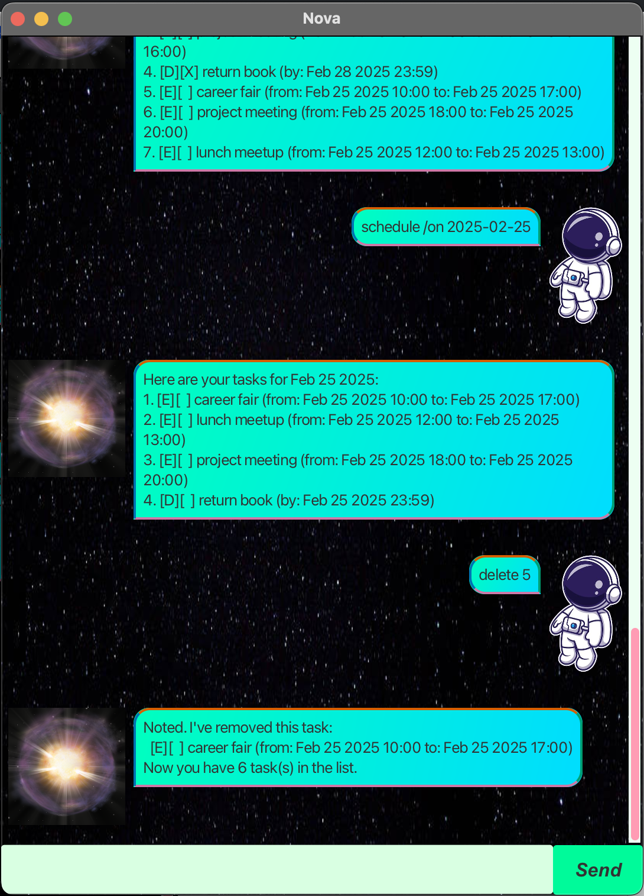

# Nova User Guide



Nova is a desktop chatbot app perfect for managing your busy schedule, optimized for use via a Command Line Interface (CLI) while still having the benefits of a Graphical User Interface (GUI). Log your schedule in Nova and free up your mental space.

## Quick start

1. Ensure you have Java `17` or above installed in your Computer.<br>
   **Mac users:** Ensure you have the precise JDK version prescribed [here](https://se-education.org/guides/tutorials/javaInstallationMac.html).

1. Download the latest `.jar` file from [here](https://github.com/Zonnie-23/ip/releases).

1. Copy the file to the folder you want to use as the _home folder_ for **Nova**.

1. Open a command terminal, `cd` into the folder you put the jar file in, and use the `java -jar Nova.jar` command to run the application.<br>

1. You are all set! Refer to the the features below for more details


## Features

:information_source: **Notes about the command format:**

* Words in `UPPER_CASE` are the parameters to be supplied by the user.<br>
  e.g. in `todo DESCRIPTION`, `DESCRIPTION` is a parameter which can be used as `todo wash laundry`.

* `DATE` information is to be provided in the following format 'YYYY-MM-DD'

* `DATETIME` information is to be provided in the following format 'YYYY-MM-DD hh:mm'

* When applicable, if no time is specified, default value is 23:59

## Getting help `help`

Provides all possible commands

Example: `help`

```
I accept the following instructions:
[deadline, event, todo, list, find, schedule, mark, unmark, delete, save, bye]
```

## Adding deadlines `deadline`

Adds a deadline to your task list

Format: `deadline DESCRIPTION /by DATETIME` or `deadline DESCRIPTION /by DATE`

Example: `deadline CS2105 Assignment 1 /by 2025-03-10`

```
Got it. I've added this task:
  [D][ ] CS2105 Assignment 1 (by: Mar 10 2025 23:59)
Now you have 1 task(s) in the list
```

## Adding events `event`

Adds an event to your task list

Format: `event DESCRIPTION /from DATETIME /to DATETIME` or `event DESCRIPTION /from DATE /to DATE`

Example: `event CS2103T tutorial /from 2025-02-20 16:00 /to 2025-02-20 17:00`

```
Got it. I've added this task:
  [E][ ] CS2103T tutorial (from: Feb 20 2025 16:00 to Feb 20 2025 17:00)
Now you have 2 task(s) in the list
```

## Adding todos `todo`

Adds a todo task to your task list

Format: `todo DESCRIPTION`

Example: `todo improve GUI for CS2103T ip`

```
Got it. I've added this task:
  [T][ ] improve GUI for CS2103T ip
Now you have 3 task(s) in the list
```

## Display tasks `list`

Display all existing task in the program

Example: `list`

```
Here are the tasks in your list:
1. [D][ ] CS2105 Assignment 1 (by: Mar 10 2025 23:59)
2. [E][ ] CS2103T tutorial (from Feb 20 2025 16:00 to Feb 20 2025 17:00)
3. [T][ ] improve GUI for CS2103T ip
```

## Finding tasks based on description `find`

Display all existing task whose description contains provided words

Format: `find WORDS`

Example: 

`find CS2103T`
```
Here are the matching tasks in your list:
1. [E][ ] CS2103T tutorial (from Feb 20 2025 16:00 to Feb 20 2025 17:00)
2. [T][ ] improve GUI for CS2103T ip
```

`find tp`

```
No matches found
```

## Display schedule for given day `schedule`

Display all tasks sequentially for a given day

Note:
* All todos are never displayed
* Date will display as `today` if the date chosen is the current date
* Schedule for the rest of today will show on startup


Format: `schedule /on DATE`

Example: 

`schedule /on 2025-02-20`

```
Here are your tasks for Feb 20 2025:
1. [E][ ] CS2103T tutorial (from Feb 20 2025 16:00 to Feb 20 2025 17:00)
```

`schedule /on 2025-02-22`

```
There are no tasks for Feb 22 2025.
```

## Update completion status of task `mark/unmark`

Mark / Unmark the task as complete

Format `mark INDEX`

`INDEX` is the task index as listed in the list command and is an integer

Example: 

`mark 1`

```
Nice! I've marked this task as done:
  [D][X] CS2105 Assignment 1 (by: Mar 10 2025 23:59)
```

`unmark 1`

```
Nice! I've unmarked this task:
  [D][ ] CS2105 Assignment 1 (by: Mar 10 2025 23:59)
```

## Delete tasks `delete`

Remove task from list

Format `delete INDEX`

Example

`delete 2`

```
Noted. I've removed this task:
  [E][ ] CS2103T tutorial (from Feb 20 2025 16:00 to Feb 20 2025 17:00)
Now you have 2 task(s) in your list
```

## Saving tasks `save`

Saves current list locally in a CSV format

Example: `save`

```
Your file has been saved.
```

## Exiting program `bye`

To close the chatbot. The chatbot will only exit after another response with a `save` or `no`.

Example: `bye`

```
Do you want to save? Type "save" to save your current list. Otherwise, type "no" to quit.
// Response "no"
Bye. Hope to see you again soon!
```

```
Do you want to save? Type "save" to save your current list. Otherwise, type "no" to quit.
// Response "save"
Your file has been saved.
Hope to see you again soon!
```

### Credits
[AB3 UserGuide](https://se-education.org/addressbook-level3/UserGuide.html#features)